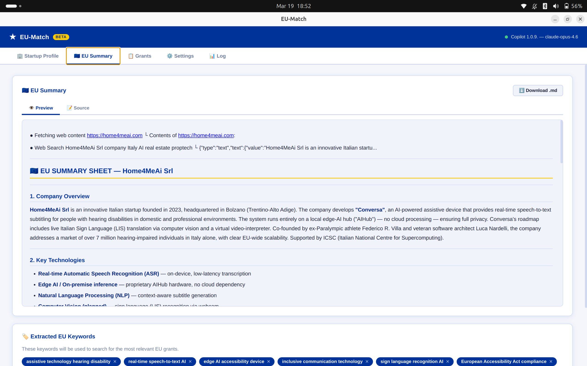
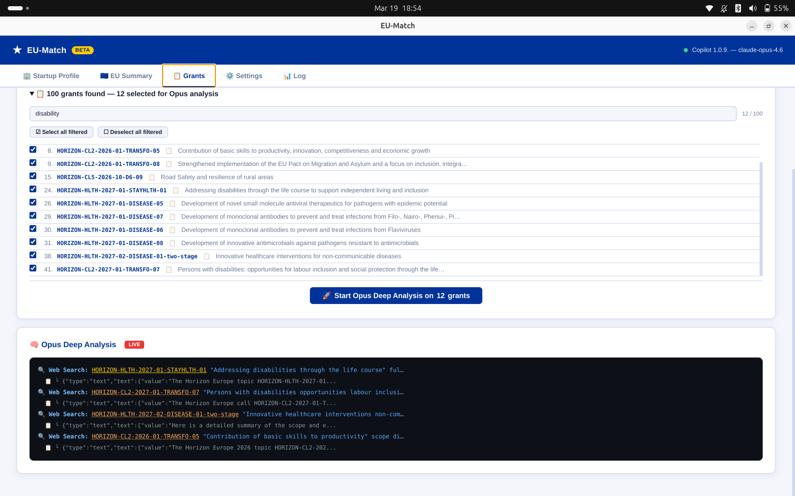
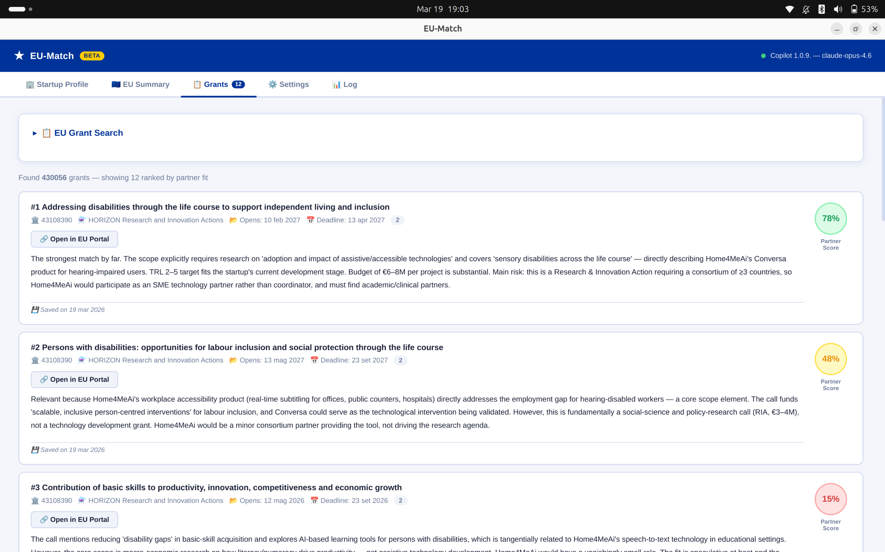
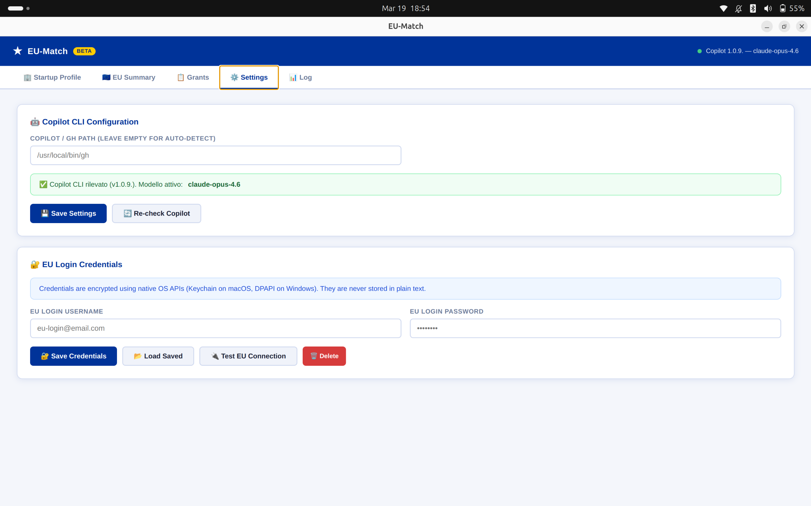

# 🇪🇺 EU Scout — AI-Powered EU Funding Scout

**Find the EU grants that actually fit your startup — in minutes, not weeks.**

[](https://github.com/lunard/startup-eu-scout/actions/workflows/deploy-web.yml)
[](https://eu-scout.codethecat.dev)
[](#)
[](#)

This monorepo contains two apps sharing the same goal:

| App | Path | Version | Platform | AI Backend |
|-----|------|---------|----------|-----------|
| **EU-Match** (desktop) | [`electron-app/`](./electron-app/) | v0.10.0 | Windows · macOS · Linux | Claude Opus via GitHub Copilot CLI |
| **EU Scout** (web/mobile) | [`web-app/`](./web-app/) | v0.2.0 | iPhone · iPad · Android · any browser | Local LLM on NPU/GPU (WebLLM) or Claude API |

---

## 🆕 EU Scout — Mobile Web App

A privacy-first Progressive Web App (PWA) for iPhone, iPad, Android tablets, and Snapdragon Elite PCs. Runs entirely in the browser with no backend server.

### Key Differences vs the Electron App

| Feature | Electron App | Web App |
|---------|-------------|---------|
| AI engine | Claude Opus via Copilot CLI | Local LLM (NPU/GPU) or Claude API |
| Storage | electron-store + OS keychain | IndexedDB + AES-256-GCM (Web Crypto) |
| Platform | Desktop only | Any modern browser, installable as PWA |
| Privacy | Local only | Local only — zero server |
| First-run | — | Hardware check + disclaimer + NPU consent |
| Offline | No | Yes (after model download) |

### Device Requirements

EU Scout detects device capabilities at startup. A **cutting-edge device** is required for local AI:

- **iPhone 15 / 16** (iOS 17.4+ for WebGPU, iOS 26 for full support)
- **iPad Pro M1, M2, M4**
- **Samsung Galaxy S23/S24/S25** or any flagship with WebGPU
- **Snapdragon X Elite** PC — Chrome/Edge (NPU accessible via WebNN)
- Any desktop with a discrete GPU and Chrome 113+

Older or low-end devices see a friendly explanation and device requirements list.

### On-Device AI Acceleration

The app detects and uses the best available hardware:

```
NPU  (Snapdragon Hexagon via WebNN)  → fastest, most efficient
GPU  (WebGPU via Metal/Vulkan)       → flagship phones/tablets
CPU  (WebAssembly fallback)          → not sufficient for LLMs — blocked
```

On iPhone 16, the **Apple Neural Engine is not yet accessible** from web browsers (only Core ML / native apps). The A18 GPU via WebGPU is used instead (~20 tok/s for 1B models). On Snapdragon X Elite, the Hexagon NPU is reachable via WebNN in Chrome/Edge.

### Running the Web App

```bash
cd web-app
npm install
npm run dev        # Dev server at http://localhost:5173
npm run build      # Production build → dist/
npm run preview    # Preview production build
```

**Live:** [https://eu-scout.codethecat.dev](https://eu-scout.codethecat.dev)
**Changelog:** [web-app/CHANGELOG.md](./web-app/CHANGELOG.md)

### Deploying

Push a semver tag to trigger the GitHub Actions pipeline:

```bash
git tag web/x.y.z
git push origin web/x.y.z
```

The pipeline builds the Docker image, pushes to ACR, deploys via Bicep to Azure Container Apps, and binds the custom domain with a managed TLS certificate.
See [`.github/workflows/deploy-web.yml`](.github/workflows/deploy-web.yml) and [`web-app/infra/main.bicep`](web-app/infra/main.bicep).

### Web App Architecture
├── src/
│   ├── components/
│   │   ├── screens/
│   │   │   ├── DeviceCheckScreen.tsx   # Hardware gate (WebGPU + GPU tier)
│   │   │   ├── DisclaimerScreen.tsx    # Privacy/AS IS disclaimer (first run)
│   │   │   └── CapabilityScreen.tsx    # NPU/GPU detected → ask to proceed
│   │   ├── tabs/
│   │   │   ├── ProfileTab.tsx          # Startup profiling (OpenCorporates + scrape)
│   │   │   ├── SummaryTab.tsx          # AI EU summary + keywords
│   │   │   ├── GrantsTab.tsx           # Search + filter + AI analysis
│   │   │   ├── SettingsTab.tsx         # LLM loader + encrypted API key
│   │   │   └── LogTab.tsx              # Live application log
│   │   └── MainApp.tsx                 # Shell + tab navigation
│   ├── lib/
│   │   ├── device-detect.ts            # WebGPU/WebNN/NPU capability detection
│   │   ├── storage.ts                  # Dexie (IndexedDB) + AES-256-GCM encryption
│   │   └── eu-search.ts                # EU Funding & Tenders API (fetch-based)
│   ├── store/
│   │   └── appStore.ts                 # Zustand global state
│   └── types/index.ts                  # Shared TypeScript types
├── vite.config.ts                      # Vite + PWA plugin + proxy config
├── tailwind.config.cjs                 # Tailwind v3 (dark EU theme)
└── package.json
```

### Tech Stack

- **React 19** + TypeScript + Vite 6
- **Tailwind CSS v3** — custom EU navy/gold/sky theme
- **Framer Motion** — smooth screen transitions and card animations
- **Zustand** — lightweight global state
- **Dexie.js** + **Web Crypto API (AES-256-GCM)** — encrypted local storage
- **@mlc-ai/web-llm** — local LLM inference (Phi-3.5-mini, Qwen 2.5, Llama 3.2)
- **TanStack Query** — async data management
- **vite-plugin-pwa** — offline PWA with service worker

---

## 🖥️ EU-Match Desktop App


## ✨ Key Features

### 🏢 Automatic Startup Profiling
Enter your company name and website. EU-Match fetches data from public business registers and scrapes your website to build a structured company profile.


### 🤖 AI-Generated EU Summary
Copilot analyses your profile and generates a structured EU summary — key technologies, target market, relevant programmes, strengths, and search keywords.



### 📋 Smart Grant Discovery & Filtering
Search the official EU Funding & Tenders Portal API with granular filters: programme, status, type of action, and funding period. Review results in an interactive accordion with full descriptions.


### 🧠 Opus Deep Analysis
The AI reads work programme documents, checks eligibility, TRL levels, budget, and consortium requirements — then ranks grants with a score and a plain-language explanation.




### 🎯 Ranked Results
Top opportunities are displayed with fit scores and justifications tailored to your startup.



### ⚙️ Settings & Logs
Configure Copilot CLI path, manage EU Login credentials, and inspect the full application log.




---

## 🚀 Getting Started

### Prerequisites

1. **Node.js ≥ 18** — [download](https://nodejs.org/)
2. **GitHub CLI** with the Copilot extension:
   ```bash
   gh auth login
   gh extension install github/gh-copilot
   ```
3. **Set your Copilot model** (Opus recommended for best results):
   ```bash
   gh copilot config set model claude-opus-4-6
   ```
   > Any Copilot model works, but Claude Opus 4.6 gives the most accurate deep-research results.

### Install & Run

```bash
git clone https://github.com/lunard/startup-eu-scout.git
cd startup-eu-scout
cd electron-app && npm install
npm start
```

### Download Pre-Built Releases

Go to [**Releases**](https://github.com/lunard/startup-eu-scout/releases) and download the installer for your platform:

| Platform | File | Notes |
|----------|------|-------|
| 🪟 Windows | `eu-match-*-win-x64.exe` | NSIS installer with Start Menu shortcut |
| 🐧 Linux | `eu-match-*-linux-x86_64.AppImage` | Portable — `chmod +x` and run |
| 🍎 macOS | `eu-match-*-mac-*.dmg` | Drag to Applications |

---

## 📖 How to Use

### Step 1 — Profile Your Startup
Enter your company name and optionally a website URL. Click **Profile Startup** — the app fetches public data and caches it locally.

### Step 2 — Generate the EU Summary
Click **Generate EU Summary with Copilot**. The AI produces a structured European profile and extracts search keywords. Edit keywords as needed to fine-tune the search.

### Step 3 — Search & Filter Grants
Set your filters (programme, status, type of action) and click **Search Grants**. The app queries the EU API, deduplicates results, and enriches each grant with full descriptions.

### Step 4 — AI-Powered Ranking
Select which grants to analyse from the accordion, then click **Start Opus Deep Analysis**. Watch the AI research each grant in real-time and receive ranked results with fit scores.

### Direct Grant Lookup
Already know a grant ID? Paste it (e.g. `HORIZON-CL2-2026-01-DEMOCRACY-05`) and skip all filters — the AI runs a deep analysis on that single grant.

---

## 🛠️ Development

### Build from Source
```bash
npm run build          # Compile TypeScript
npm start              # Build + launch Electron
```

### Package for Distribution
```bash
npm run build:linux    # Linux AppImage (x64)
npm run build:win      # Windows NSIS installer (x64)
npm run build:mac      # macOS DMG
```
Output goes to `release/`.

### CI/CD
Every tagged release (`v*`) triggers a [GitHub Actions workflow](.github/workflows/release.yml) that builds all three platforms in parallel and publishes a GitHub Release with the artifacts.

### Project Structure
```
src/
├── main.ts                # Electron main process + IPC handlers
├── preload.ts             # contextBridge API (renderer ↔ main)
├── types.ts               # Shared TypeScript interfaces
├── storage.ts             # electron-store profile cache + settings
├── credential-manager.ts  # safeStorage (Keychain/DPAPI)
├── startup-profiler.ts    # OpenCorporates API + cheerio web scraping
├── copilot-bridge.ts      # Copilot CLI integration (summary, ranking, analysis)
├── eu-search.ts           # EU Funding & Tenders API (search + crawl)
└── eu-auth.ts             # EU Login credential testing
renderer/
├── index.html             # Multi-tab UI
├── app.ts                 # Renderer logic
├── styles.css             # EU-branded design system
└── types/eu-match.d.ts    # Renderer type declarations
```

---

## 📝 License

Apache 2.0 — see [LICENSE](LICENSE).

