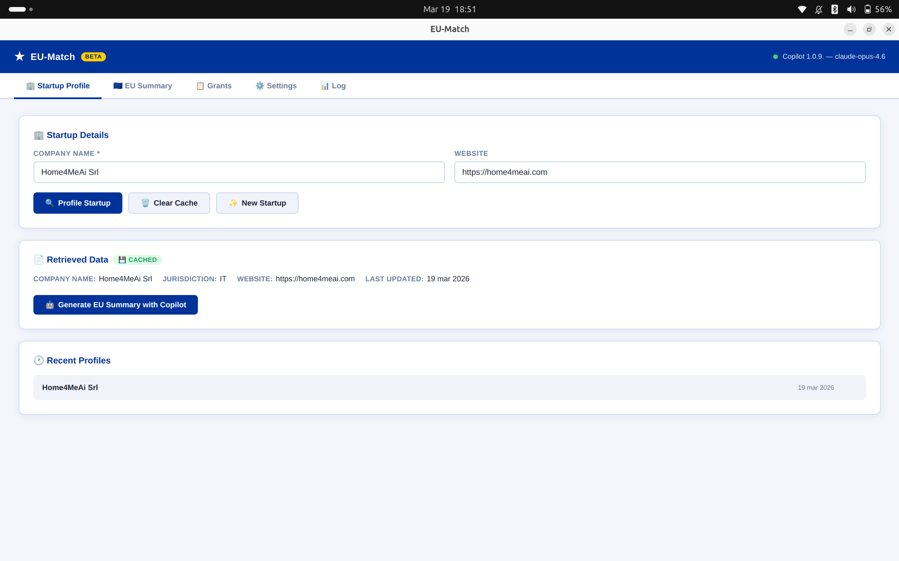
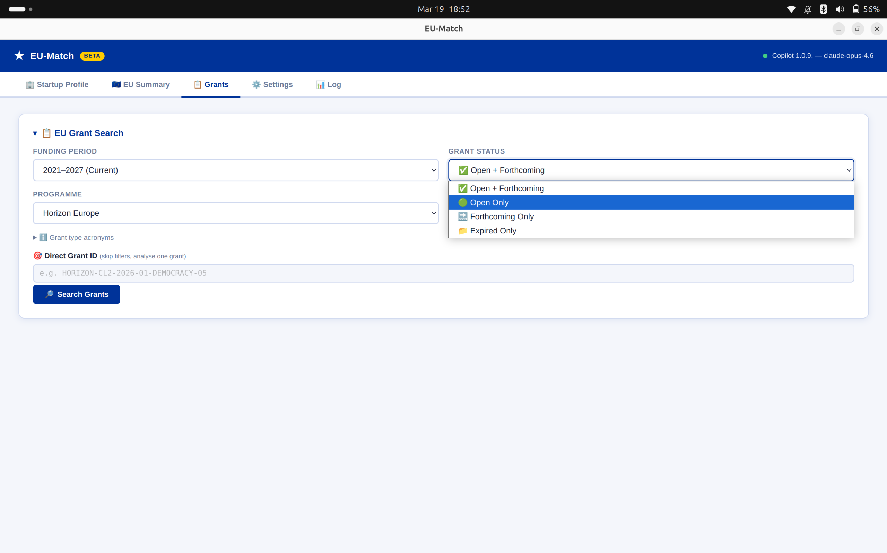
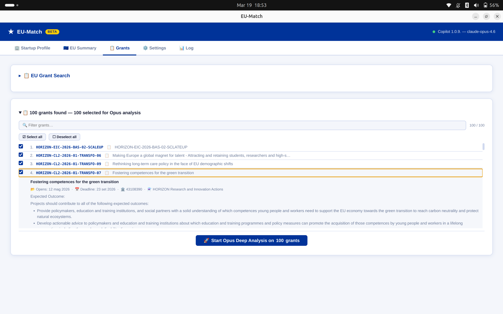
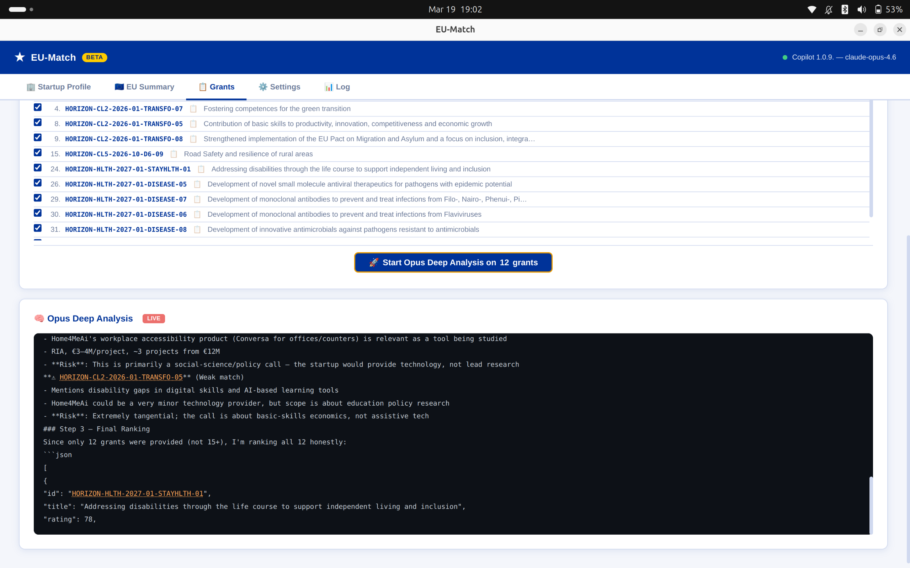
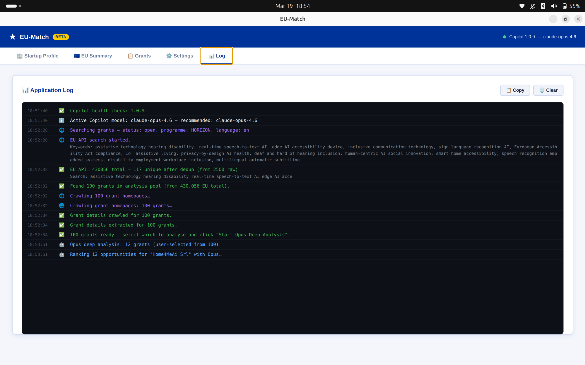

# 🇪🇺 EU-Match — AI-Powered EU Funding Scout

**Find the EU grants that actually fit your startup — in minutes, not weeks.**

EU-Match is a desktop app that combines company profiling, the official EU Funding & Tenders API, and AI deep-research to discover, filter, and rank the best European funding opportunities for your startup.

> **How it works:** Enter your company name → the app builds a European profile → searches hundreds of EU grants → an AI agent reads work programme documents, checks eligibility, and ranks the top best-fit opportunities with detailed explanations.

---

## ✨ Key Features

### 🏢 Automatic Startup Profiling
Enter your company name and website. EU-Match fetches data from public business registers and scrapes your website to build a structured company profile.



### 🤖 AI-Generated EU Summary
Copilot analyses your profile and generates a structured EU summary — key technologies, target market, relevant programmes, strengths, and search keywords.


### 📋 Smart Grant Discovery & Filtering
Search the official EU Funding & Tenders Portal API with granular filters: programme, status, type of action, and funding period. Review results in an interactive accordion with full descriptions.





### 🧠 Opus Deep Analysis
The AI reads work programme documents, checks eligibility, TRL levels, budget, and consortium requirements — then ranks grants with a score and a plain-language explanation.




### 🎯 Ranked Results
Top opportunities are displayed with fit scores and justifications tailored to your startup.


### ⚙️ Settings & Logs
Configure Copilot CLI path, manage EU Login credentials, and inspect the full application log.




---

## 🚀 Getting Started

### Prerequisites

1. **Node.js ≥ 18** — [download](https://nodejs.org/)
2. **GitHub CLI** with the Copilot extension:
   ```bash
   gh auth login
   gh extension install github/gh-copilot
   ```
3. **Set your Copilot model** (Opus recommended for best results):
   ```bash
   gh copilot config set model claude-opus-4-6
   ```
   > Any Copilot model works, but Claude Opus 4.6 gives the most accurate deep-research results.

### Install & Run

```bash
git clone https://github.com/lunard/startup-eu-scout.git
cd startup-eu-scout
npm install
npm start
```

### Download Pre-Built Releases

Go to [**Releases**](https://github.com/lunard/startup-eu-scout/releases) and download the installer for your platform:

| Platform | File | Notes |
|----------|------|-------|
| 🪟 Windows | `eu-match-*-win-x64.exe` | NSIS installer with Start Menu shortcut |
| 🐧 Linux | `eu-match-*-linux-x86_64.AppImage` | Portable — `chmod +x` and run |
| 🍎 macOS | `eu-match-*-mac-*.dmg` | Drag to Applications |

---

## 📖 How to Use

### Step 1 — Profile Your Startup
Enter your company name and optionally a website URL. Click **Profile Startup** — the app fetches public data and caches it locally.

### Step 2 — Generate the EU Summary
Click **Generate EU Summary with Copilot**. The AI produces a structured European profile and extracts search keywords. Edit keywords as needed to fine-tune the search.

### Step 3 — Search & Filter Grants
Set your filters (programme, status, type of action) and click **Search Grants**. The app queries the EU API, deduplicates results, and enriches each grant with full descriptions.

### Step 4 — AI-Powered Ranking
Select which grants to analyse from the accordion, then click **Start Opus Deep Analysis**. Watch the AI research each grant in real-time and receive ranked results with fit scores.

### Direct Grant Lookup
Already know a grant ID? Paste it (e.g. `HORIZON-CL2-2026-01-DEMOCRACY-05`) and skip all filters — the AI runs a deep analysis on that single grant.

---

## 🛠️ Development

### Build from Source
```bash
npm run build          # Compile TypeScript
npm start              # Build + launch Electron
```

### Package for Distribution
```bash
npm run build:linux    # Linux AppImage (x64)
npm run build:win      # Windows NSIS installer (x64)
npm run build:mac      # macOS DMG
```
Output goes to `release/`.

### CI/CD
Every tagged release (`v*`) triggers a [GitHub Actions workflow](.github/workflows/release.yml) that builds all three platforms in parallel and publishes a GitHub Release with the artifacts.

### Project Structure
```
src/
├── main.ts                # Electron main process + IPC handlers
├── preload.ts             # contextBridge API (renderer ↔ main)
├── types.ts               # Shared TypeScript interfaces
├── storage.ts             # electron-store profile cache + settings
├── credential-manager.ts  # safeStorage (Keychain/DPAPI)
├── startup-profiler.ts    # OpenCorporates API + cheerio web scraping
├── copilot-bridge.ts      # Copilot CLI integration (summary, ranking, analysis)
├── eu-search.ts           # EU Funding & Tenders API (search + crawl)
└── eu-auth.ts             # EU Login credential testing
renderer/
├── index.html             # Multi-tab UI
├── app.ts                 # Renderer logic
├── styles.css             # EU-branded design system
└── types/eu-match.d.ts    # Renderer type declarations
```

---

## 📝 License

Apache 2.0 — see [LICENSE](LICENSE).

